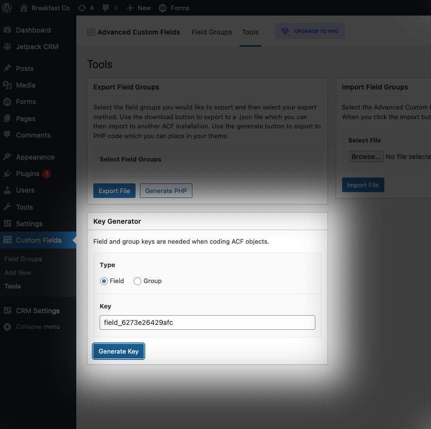

# advanced-custom-fields-key-generator

> **Warning**
> Do not use. I merged this feature into [Power Boost for ACF](https://github.com/csalzano/power-boost-acf), a plugin with more than one feature that enhances ACF. Use Power Boost instead.

WordPress plugin. An add-on for Advanced Custom Fields. Adds a button at Custom Fields → Tools that generates field and group keys.

This plugin provides a user interface for this JavaScript: `acf.uniqid('field_');`

## Screenshot

